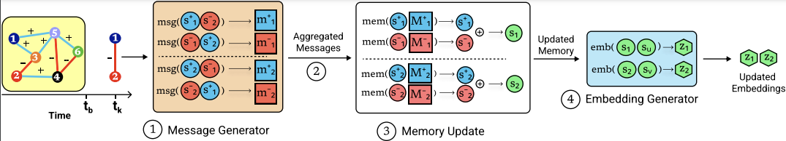

# Representation Learning in Continuous-Time Dynamic Signed Networks

Supplementary code for the work published at CIKM 2023. 

Paper link: (To appear)

Arxiv: [https://arxiv.org/abs/2207.03408](https://arxiv.org/abs/2207.03408)

## Citation

> @inproceedings{sharma2023representation,\
    title={Representation Learning in Continuous-Time Dynamic Signed Networks},\
    author={Sharma, Kartik and Raghavendra, Mohit and Lee, Yeon-Chang and Kumar M, Anand and Kumar, Srijan},\
    booktitle={32nd ACM International Conference on Information and Knowledge Management},\
    year={2023},\
    url={https://doi.org/10.1145/3583780.3615032}\
}

&nbsp;

## Requirements
We use Python 3.8 for this implementation. Our code extensively uses the following 3 libraries: 
1. PyTorch 1.7 ([link](https://pytorch.org/get-started/locally/))
2. PyTorch Geometric ([link](https://pytorch-geometric.readthedocs.io/en/latest/notes/installation.html))

Follow the steps in the given links to install these libraries for your system configuration. 

A full set of requirements is given in `requirements.txt`, which can be used to create a conda virtual environment as:

> `conda create --name <env> --file requirements.txt`

## Data

We use these 4 datasets in this work:
1. BTC-OTC ([link](https://snap.stanford.edu/data/soc-sign-bitcoin-otc.html))
2. BTC-Alpha ([link](https://snap.stanford.edu/data/soc-sign-bitcoin-alpha.html))
3. WikiRFA ([link](https://snap.stanford.edu/data/wiki-RfA.html))
4. Epinions ([link](https://snap.stanford.edu/data/soc-sign-epinions.html)) 

These will be automatically downloaded and processed inside the root directory `data/`.

## Training the models
> `python train.py --model \<MODEL> --dataset \<DATASET> --task \<TASK>`

where we allow the following possibilities 

| | |
| -- | -- |
| MODEL | gcn, gat, sgcn, sigat, tgn, tgat, caw, sgclstm, semba |
| DATASET | BitcoinOTC-1, BitcoinAlpha-1, epinions, wikirfa |
| TASK | signlink_class, sign_class, link_pred |

**Example run:** `./run.sh`

In addition, we can tune other hyperparameters such as number of epochs, initial learning rate, embedding dimensions, negative weight, and so on. We provide the best run details of some of these in `best_run_details.csv` while we use the default parameters for others. 

Note that for Epinions dataset, pass the batch size as `--batch_size 16000`. 

**Running all methods:** `./run_baselines.sh`

**Saved models:** We also provide saved models for each model, dataset, and task triplet except for Epinions. Test performance can be found by simply running `python eval.py --model \<MODEL> --dataset \<DATASET> --task \<TASK>`. All saved models are provided at [https://drive.google.com/file/d/1LEtIYwY67NlJsmMXkepOX6fstO8HA8vM/view?usp=drive_link](https://drive.google.com/file/d/1LEtIYwY67NlJsmMXkepOX6fstO8HA8vM/view?usp=drive_link)